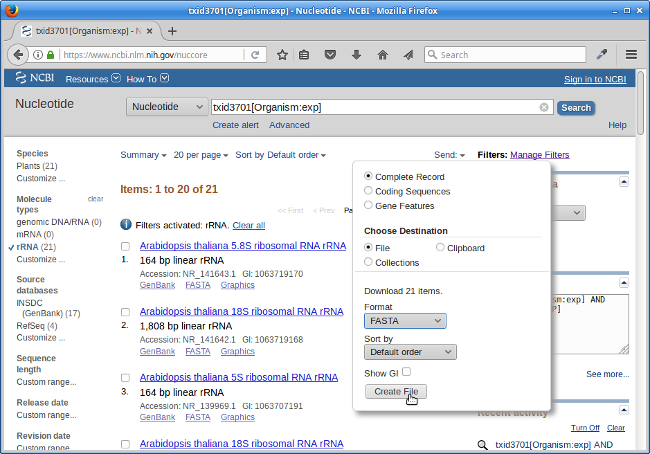

== Setting up our experiment

In this exercise, we will learn how to preprocess our data for alignment. We will be doing adapter trimming and quality trimming. Make sure you are logged into a compute node, not the head node (cabernet): use the 'srun' command to do this.

<<<<<<< HEAD
**1\.** First, create a directory for the example in your home directory:

    cd
    mkdir rnaseq_example

---

**2\.** Next, go into that directory and link to the directory for your raw data. This data comes from an Arabidopsis RNA-Seq project that we did:

    cd rnaseq_example
    ln -s /share/biocore/workshops/2018_June_RNAseq/00-RawData .

---

**3\.** Now, take a look inside that directory.

    cd 00-RawData
    ls

---

**4\.** You will see a list of directories and some other files. Take a look at all the files in all of the directories:

    ls *

---

**5\.** Pick a directory and go into it. Look at one of the files using the 'zless' command (which is just the 'less' command for gzipped files):
=======
**1\.** Pick a sample directory within your raw data and go into it. Look at one of the files using the 'zless' command (which is just the 'less' command for gzipped files):
>>>>>>> ce311d2357038848bca2fd172c3dee19f03d1e17

    cd ~/rnaseq_example/00-RawData/
    cd I894/
    zless I894_S90_L006_R1_001.fastq.gz

Make sure you can identify which lines correspond to a single read and which lines are the header, sequence, and quality values. Press 'q' to exit this screen. Then, let's figure out the number of reads in this file. A simple way to do that is to count the number of lines and divide by 4 (because the record of each read uses 4 lines). In order to do this, use "zcat" to output the uncompressed file and pipe that to "wc" to count the number of lines:

    zcat I894_S90_L006_R1_001.fastq.gz | wc -l

Divide this number by 4 and you have the number of reads in this file. One more thing to try is to figure out the length of the reads without counting each nucleotide. First get the first 4 lines of the file (i.e. the first record):

    zcat I894_S90_L006_R1_001.fastq.gz | head -4

Then, copy and paste the sequence line into the following command (replace [sequence] with the line):

    echo -n [sequence] | wc -c

This will give you the length of the read. See if you can figure out how this command works.

---

**2\.** Now go back to your 'rnaseq_example' directory and create another directory called '01-HTS_Preproc':

    cd ~/rnaseq_example/
    mkdir 01-HTS_Preproc
    cd 01-HTS_Preproc

== Sequence preprocessing

**Why preprocess reads**

We have found that aggressively “cleaning” and processing reads can make a large difference to the speed and quality of mapping and assembly results. Cleaning your reads means, removing reads/bases that are:
  * Other unwanted sequence (Ex. polyA tails in RNAseq data)
  * Artificially added onto sequence of primary interest (vectors, adapters, primers)
  * join short overlapping paired-end reads
  * low quality bases
  * originate from PCR duplication
  * not of primary interest (contamination)

Preprocessing also produces a number of statistics that are technical in nature that should be used to evaluate “experimental consistency”.

**Many read preprocessing strategies over time**

* Identity and remove contaminant and vector reads
  * Reads which appear to fully come from extraneous sequence should be removed.
* Quality trim/cut
  * “End” trim a read until the average quality > Q (Lucy)
  * Remove any read with average quality < Q
* Eliminate singletons/duplicates
  * If you have excess depth of coverage, and particularly if you have at least x-fold coverage where x is the read length, then eliminating singletons is a nice way of dramatically reducing the number of error-prone reads.
  * Read which appear the same (particularly paired-end) are often more likely PCR duplicates and therefor redundant reads.
* Eliminate all reads (pairs) containing an “N” character
  * If you can afford the loss of coverage, you might throw away all reads containing Ns.
* Identity and trim off adapter and barcodes if present
  * Believe it or not, the software provided by Illumina, either does not look for, or does a mediocre job of, identifying adapters and removing them.

** Many technical things happen between original sample and data, preprocessing is working backwards through that process to get as close as we can to original sample **

1. Remove contaminants (at least PhiX).
2. Remove PCR duplicates.
3. Identify rRNA proportion.
4. Join and potentially extend, overlapping paired end reads
5. If reads completely overlap they will contain adapter, remove adapters
6. Identify and remove any adapter dimers present
7. Trim sequences (5’ and 3’) by quality score (I like Q20)
8. Cleanup
  * Remove any reads that are less then the minimum length parameter
  * Run a polyA/T trimmer (optional)
  * Produce preprocessing statistics

### HTStream - preprocessing application

Can be downloaded from [here](https://github.com/ibest/HTStream). Fast C++ implementation, designed to have discreet applications that can be pipelined together using unix piping. We hope in the long run to include any and all needed preprocessing routines. Includes:

* hts_AdapterTrimmer - identify and remove adapter sequences
* hts_NTrimmer - extrat the longest subsequence with no Ns
* hts_PolyATTrim - identify and remove polyA/T sequence (least robust algorithm)
* hts_SeqScreener - identify and remove/keep/count contaminants (default phiX)
* hts_SuperDeduper - identify and remove PCR duplicates
* hts_CutTrim - discreet 5' and/or 3' basepair trimming
* hts_Overlapper - Overlap paired end reads (cutting off adapters when present)
* hts_QWindowTrim - 5' and/or 3' prime quality score trimming using windows
* hts_Stats - compute read stats

**3\.** Let's run the first step of our HTStream preprocessing pipeline, which is always to gather basic stats on the read files. For now, we're only going to run one sample through the pipeline. So let's take a sample of those reads, just so our trial run through the pipeline goes really quickly.

    zcat ../00-RawData/C61/C61_S67_L006_R1_001.fastq.gz | head -400000 | gzip > C61_R1.subset.fastq.gz
    zcat ../00-RawData/C61/C61_S67_L006_R2_001.fastq.gz | head -400000 | gzip > C61_R2.subset.fastq.gz

Now we'll run the first step ... hts_Stats.

    module load htstream/0.3.0
    hts_Stats --help
    hts_Stats -1 C61_R1.subset.fastq.gz \
              -2 C61_R2.subset.fastq.gz \
              -L C61.log -f -g -p C61.stats

---

**4\.** In order to run the next commands, we need to find sequences of ribosomal RNA. We will use these sequences to eliminate rRNA contamination in our reads, which are from Arabidopsis thaliana. One way to do that is to go to [NCBI](https://www.ncbi.nlm.nih.gov/) and search for them. First, go to NCBI and in the Search dropdown select "Taxonomy" and search for "arabidopsis".

Click on "Arabidopsis":

Click on "Arabidopsis" again:

Click on the "Subtree links" for Nucleotide:

Under Molecule Types, click on "rRNA":

Click on "Send", choose "File", choose Format "FASTA", and click on "Create File".

Save this file to your computer, and rename it to 'rrna.fasta'. Now, make a directory in your "rnaseq_example" directory called "ref":

    mkdir ~/rnaseq_example/ref

Upload your rrna.fa file to this ref directory on the cluster using either **scp** or FileZilla.

---

<<<<<<< HEAD
**9\.** We're going to blaze through the rest of the steps now, and then collect the stats of the reads at the end of the process.
=======
**5\.** We're going to blaze through the rest of the steps now, and then collect the stats of the reads at the end of the process. 
>>>>>>> ce311d2357038848bca2fd172c3dee19f03d1e17

    hts_SeqScreener -1 C61.stats_R1.fastq.gz -2 C61.stats_R2.fastq.gz -A -L C61.log -f -g -p C61.seqscreener
    hts_SuperDeduper -1 C61.seqscreener_R1.fastq.gz -2 C61.seqscreener_R2.fastq.gz -A -L C61.log -f -g -p C61.superdeduper
    hts_SeqScreener -s ../ref/rrna.fasta -1 C61.superdeduper_R1.fastq.gz -2 C61.superdeduper_R2.fastq.gz \
                    -A -L C61.log -f -g -p C61.seqscreener.rRNA
    hts_AdapterTrimmer -n -1 C61.seqscreener.rRNA_R1.fastq.gz -2 C61.seqscreener.rRNA_R2.fastq.gz -f -g -p C61.adaptertrimmer
    hts_QWindowTrim -n -1 C61.adaptertrimmer_R1.fastq.gz -2 C61.adaptertrimmer_R2.fastq.gz -A -L C61.log -f -g -p C61.qtrim
    hts_NTrimmer -n -1 C61.qtrim_R1.fastq.gz -2 C61.qtrim_R2.fastq.gz -A -L C61.log -f -g -p C61.ntrim
    hts_CutTrim -m 50 -1 C61.ntrim_R1.fastq.gz -2 C61.ntrim_R2.fastq.gz -A -L C61.log -f -g -p C61.cuttrim
    ls -ltrha  # notice how few SE reads there are!
    hts_Stats -1 C61.cuttrim_R1.fastq.gz -2 C61.cuttrim_R2.fastq.gz -A -L C61.log -f -g -p C61.final

Notice the patterns? In every step we read in reads (-1 and -2), append (-A) stats to a log file (-L), then output gzipped fastq (-f -g) with names starting with a pattern describing that step (-p). Use the command 'ls -ltrha' to look at the fastq file sizes along the way; they shrink when there's data removed from them, either parts of reads or whole read pairs.

---

**6\.** Matt's json visualization? ###########################################################################

---

**7\.** Alternatively, it's cleaner to stream data from one HTStream component to the next, not save the intermediate files, but still log stats from each step. We'll use a SLURM script that we should take a look at now.

    cd ~/rnaseq_example  # We'll run this from the main directory
    cp /share/biocore/workshops/2018_June_RNAseq/hts_preproc.slurm .
    cat hts_preproc.slurm

After looking at the script, let's run it. First we'll need to produce a list of samples for the script to work on.

    ls 00-RawData > 00-RawData/samples.txt
    cat samples.txt  # should just list each sample, one per line
    sbatch hts_preproc.slurm  # moment of truth!

We can watch the progress of our task array using the 'squeue' command:

    squeue -u [class42]  # use your actual username, no brackets

---

**8\.** Once that is done, let's take a look at the differences between the input and output files. First look at the input file:

    zless 00-RawData/I894/I894_S90_L006_R1_001.fastq.gz

Let's search for the adapter sequence. Type '/' (a forward slash), and then type **AGATCGGAAGAGCACACGTCTGAACTCCAGTCAC** (the first part of the forward adapter). Press Enter. This will search for the sequence in the file and highlight each time it is found. You can now type "n" to cycle through the places where it is found. When you are done, type "q" to exit. Now look at the output file:

    zless 01-HTS_Preproc/I894/I894_R1.fastq.gz

If you scroll through the data (using the spacebar), you will see that some of the sequences have been trimmed. Now, try searching for **AGATCGGAAGAGCACACGTCTGAACTCCAGTCAC** again. You shouldn't find it. You may need to use Control-C to get out of the search and then "q" to exit the 'less' screen.

---
