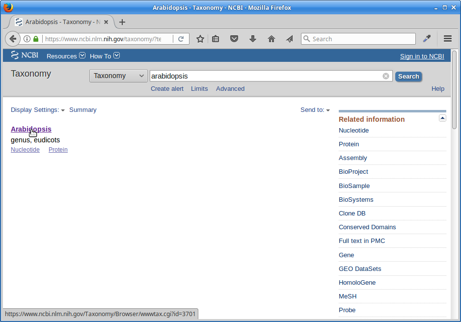
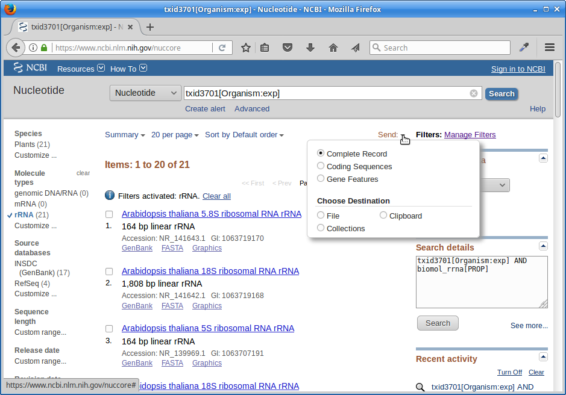

Data Setup
===================

Let's set up a project directory for the week, and talk a bit about project philosophy..

**1\.** First, create a directory for the project example in your home directory:

    cd
    mkdir rnaseq_example

---

**2\.** Next, go into that directory, create a data directory, and link to the directory for your raw data.

    cd rnaseq_example
    mkdir 00-RawData
    cd 00-RawData/
    ln -s /share/biocore/workshops/2018_June_RNAseq/00-RawData/* .
    for i in [CI]*; do echo $i; done > samples  # collect directory / sample names into a file

---

**3\.** Now, take a look inside that directory.

    ls

--- 

**4\.** You will see a list of directories and some other files. Take a look at all the files in all of the directories:

    ls *

---

**5\.** Pick a directory and go into it. Look at one of the files using the 'zless' command (which is just the 'less' command for gzipped files):

    cd I894/
    zless I894_S90_L006_R1_001.fastq.gz

Make sure you can identify which lines correspond to a single read and which lines are the header, sequence, and quality values. Press 'q' to exit this screen. Then, let's figure out the number of reads in this file. A simple way to do that is to count the number of lines and divide by 4 (because the record of each read uses 4 lines). In order to do this, use "zcat" to output the uncompressed file and pipe that to "wc" to count the number of lines:

    zcat I894_S90_L006_R1_001.fastq.gz | wc -l

Divide this number by 4 and you have the number of reads in this file. One more thing to try is to figure out the length of the reads without counting each nucleotide. First get the first 4 lines of the file (i.e. the first record):

    zcat I894_S90_L006_R1_001.fastq.gz | head -4

Note the header lines (1st and 3rd line) and sequence and quality lines (2nd and 4th) in each 4-line fastq block. Then, copy and paste the sequence line into the following command (replace [sequence] with the line):

    echo -n [sequence] | wc -c

This will give you the length of the read. See if you can figure out how this command works.

---

**6\.** Now go back to your 'rnaseq_example' directory and create another directory called '01-HTS_Preproc':

    cd ~/rnaseq_example
    mkdir 01-HTS_Preproc
    cd 01-HTS_Preproc

The results of our preprocessing steps will be put into the 01-HTS_Preproc directory. The next step after that will go into a "02-..." directory, etc. You can collect scripts that perform each step, and notes and metadata relevant for each step, in the directory for that step. This way anyone looking to replicate your analysis has limited places to search for the commands you used. In addition, you may want to change the permissions on your original 00-RawData directory to "read only", so that you can never corrupt your raw data. (We won't worry about this here, because we've linked in sample folders and this would complicate things).

---

**7\.** Let's run the first step of our HTStream preprocessing pipeline, which is always to gather basic stats on the read files. For now, we're only going to run one sample through the pipeline. So let's take a sample of those reads, just so our trial run through the pipeline goes really quickly.

    zcat ../00-RawData/C61/C61_S67_L006_R1_001.fastq.gz | head -400000 | gzip > C61_R1.subset.fastq.gz
    zcat ../00-RawData/C61/C61_S67_L006_R2_001.fastq.gz | head -400000 | gzip > C61_R2.subset.fastq.gz

Now we'll run the first step ... hts_Stats.

    module load htstream/0.3.0
    hts_Stats --help
    hts_Stats -1 C61_R1.subset.fastq.gz \
              -2 C61_R2.subset.fastq.gz \
              -L C61.log -f -g -p C61.stats

---

**8\.** In order to run the next commands, we need to find sequences of ribosomal RNA. We will use these sequences to eliminate rRNA contamination in our reads, which are from Arabidopsis thaliana. One way to do that is to go to [NCBI](https://www.ncbi.nlm.nih.gov/) and search for them. First, go to NCBI and in the Search dropdown select "Taxonomy" and search for "arabidopsis".

Click on "Arabidopsis":

Click on "Arabidopsis" again:

Click on the "Subtree links" for Nucleotide:

Under Molecule Types, click on "rRNA":

Click on "Send", choose "File", choose Format "FASTA", and click on "Create File".

Save this file to your computer, and rename it to 'rrna.fasta'. Now, make a directory in your "rnaseq_example" directory called "ref":

    mkdir ~/rnaseq_example/ref

Upload your rrna.fa file to this ref directory on the cluster using either **scp** or FileZilla.

---

**9\.** We're going to blaze through the rest of the steps now, and then collect the stats of the reads at the end of the process. 

    hts_SeqScreener -1 C61.stats_R1.fastq.gz -2 C61.stats_R2.fastq.gz -A -L C61.log -f -g -p C61.seqscreener
    hts_SuperDeduper -1 C61.seqscreener_R1.fastq.gz -2 C61.seqscreener_R2.fastq.gz -A -L C61.log -f -g -p C61.superdeduper
    hts_SeqScreener -s ../ref/rrna.fasta -1 C61.superdeduper_R1.fastq.gz -2 C61.superdeduper_R2.fastq.gz \
                    -A -L C61.log -f -g -p C61.seqscreener.rRNA
    hts_AdapterTrimmer -n -1 C61.seqscreener.rRNA_R1.fastq.gz -2 C61.seqscreener.rRNA_R2.fastq.gz -f -g -p C61.adaptertrimmer
    hts_QWindowTrim -n -1 C61.adaptertrimmer_R1.fastq.gz -2 C61.adaptertrimmer_R2.fastq.gz -A -L C61.log -f -g -p C61.qtrim
    hts_NTrimmer -n -1 C61.qtrim_R1.fastq.gz -2 C61.qtrim_R2.fastq.gz -A -L C61.log -f -g -p C61.ntrim
    hts_CutTrim -m 50 -1 C61.ntrim_R1.fastq.gz -2 C61.ntrim_R2.fastq.gz -A -L C61.log -f -g -p C61.cuttrim
    ls -ltrha  # notice how few SE reads there are!
    hts_Stats -1 C61.cuttrim_R1.fastq.gz -2 C61.cuttrim_R2.fastq.gz -A -L C61.log -f -g -p C61.final

Notice the patterns? In every step we read in reads (-1 and -2), append (-A) stats to a log file (-L), then output gzipped fastq (-f -g) with names starting with a pattern describing that step (-p). Use the command 'ls -ltrha' to look at the fastq file sizes along the way; they shrink when there's data removed from them, either parts of reads or whole read pairs.

---

**10\.** Matt's json visualization? ###########################################################################

---

**11\.** Alternatively, it's cleaner to stream data from one HTStream component to the next, not save the intermediate files, but still log stats from each step. We'll use a SLURM script that we should take a look at now.

    cd ~/rnaseq_example  # We'll run this from the main directory
    cp /share/biocore/workshops/2018_June_RNAseq/hts_preproc.slurm .
    cat hts_preproc.slurm

After looking at the script, let's run it. First we'll need to produce a list of samples for the script to work on.

    cd ~/rnaseq_example
    ls 00-RawData > 00-RawData/samples.txt
    cat 00-RawData/samples.txt  # should just list each sample, one per line
    sbatch hts_preproc.slurm  # moment of truth!

We can watch the progress of our task array using the 'squeue' command:

    squeue -u [class42]  # use your actual username, no brackets

---

**12\.** Once that is done, let's take a look at the differences between the input and output files. First look at the input file:

    zless 00-RawData/I894/I894_S90_L006_R1_001.fastq.gz

Let's search for the adapter sequence. Type '/' (a forward slash), and then type **AGATCGGAAGAGCACACGTCTGAACTCCAGTCAC** (the first part of the forward adapter). Press Enter. This will search for the sequence in the file and highlight each time it is found. You can now type "n" to cycle through the places where it is found. When you are done, type "q" to exit. Now look at the output file:

    zless 01-HTS_Preproc/I894/I894_R1.fastq.gz

If you scroll through the data (using the spacebar), you will see that some of the sequences have been trimmed. Now, try searching for **AGATCGGAAGAGCACACGTCTGAACTCCAGTCAC** again. You shouldn't find it. You may need to use Control-C to get out of the search and then "q" to exit the 'less' screen.

---

